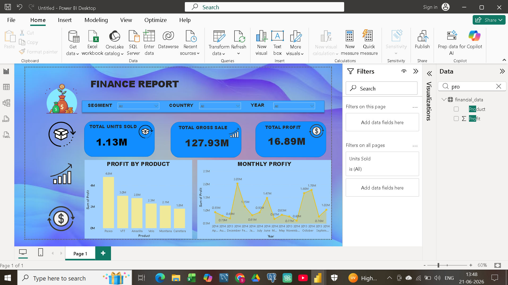

# Global Financial Performance Dashboard 📊

An interactive, end-to-end data analysis project that transforms raw multi-country corporate financials into actionable business intelligence. This project utilizes **Power BI**, **Excel (Power Query)**, and **SQL** to clean, model, and visualize business performance across global markets, products, and customer segments.

---

## 🚀 Dashboard Preview

The main dashboard interface, user experience features, and core visual matrices can be reviewed below:



---

## 📈 Executive Key Performance Indicators (KPIs)

Based on the dataset optimization and data modeling phases, the dashboard tracks the following top-level business actuals:

* **Total Units Sold:** `1,125,806` Units
* **Gross Sales Revenue:** `$118.73M`
* **Total Gross Profit:** `$16.89M`
* **Total COGS (Cost of Goods Sold):** `$101.83M`
* **Total Discounts Distributed:** `$9.21M`
* **Net Profit Margin:** `14.23%`

---

## 🔍 Core Data-Driven Financial Insights

* **👑 Government Sector Dominance:** The Government segment is the primary engine of profitability, generating a remarkable **$11.39M** in net profit. Small Business operations follow as the second highest contributor at **$4.14M**.
* **🚨 Enterprise Segment Risk Management:** The Enterprise sector experienced a net loss of **-$614,545.62**. The financial model reveals that heavy manufacturing costs and operational COGS ($20.22M) outpaced net revenue ($19.61M), calling for immediate price adjustments or cost-cutting strategies.
* **📦 Product Portfolio Leader:** **Paseo** stands out as the undisputed market leader, accounting for **$33.01M** in gross sales and delivering a peak profit contribution of **$4.80M**. Conversely, **Carretera** was the lowest margin performer at **$1.83M**.
* **🌍 Geographically Balanced Sales Distribution:** Market demand is highly stable across borders. The **United States** leads total sales revenue with **$25.03M**, with Canada ($24.89M), France ($24.35M), and Germany ($23.51M) following in close, competitive proximity.
* **📈 Seasonal Sales Spikes:** Trend analysis marks **October ($21.67M)** and **December ($17.37M)** as peak sales months, showing highly positive correlation with seasonal demand and target marketing cycles.

---

## 🛠️ Dashboard Visual Features

* **Revenue Trend Analysis:** Time-series tracking to monitor month-on-month sales trajectories and identify seasonal peaks.
* **Profit & Margin Distribution:** Deep-dive logic blocks separating profitable channels from loss-making operational segments.
* **Expense & COGS Overlays:** Interactive cost vs. margin variance maps to quickly locate where supply chain or production costs are cutting into margins.
* **Discount Impact Monitoring:** Analyzing how different discount bands (None, Low, Medium, High) affect transaction volumes versus final profit margins.

---

## 🧰 Tools & Technologies Used

* **Power BI Desktop:** Implemented star schema data modeling, established dimensional relationships, and structured an interactive visualization layer.
* **Excel / Power Query:** Managed initial ETL (Extract, Transform, Load) pipelines, including column whitespace trimming, currency format normalization, and handling empty rows.
* **DAX (Data Analysis Expressions):** Engineered optimized metrics and advanced time-intelligence measures for dynamic running totals, margins, and cost distribution patterns.
* **SQL:** Used for mock database validation, structured query groupings, and data aggregation checks.

---

## 📂 How to Set Up & View the Project

1. **Clone the Repository:**
   ```bash
   git clone [https://github.com/sachiuhhigt/finance-dashboard.git](https://github.com/sachiuhhigt/finance-dashboard.git)